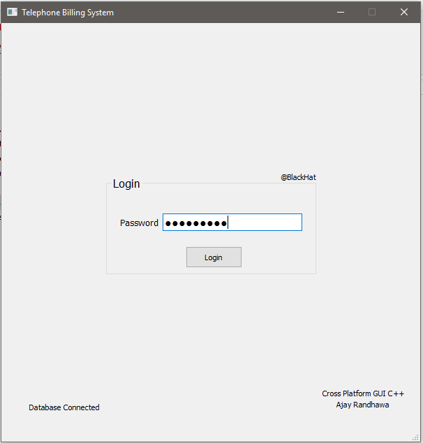
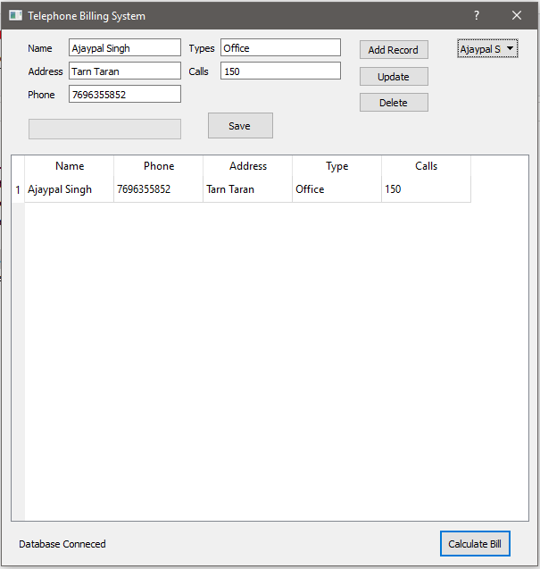
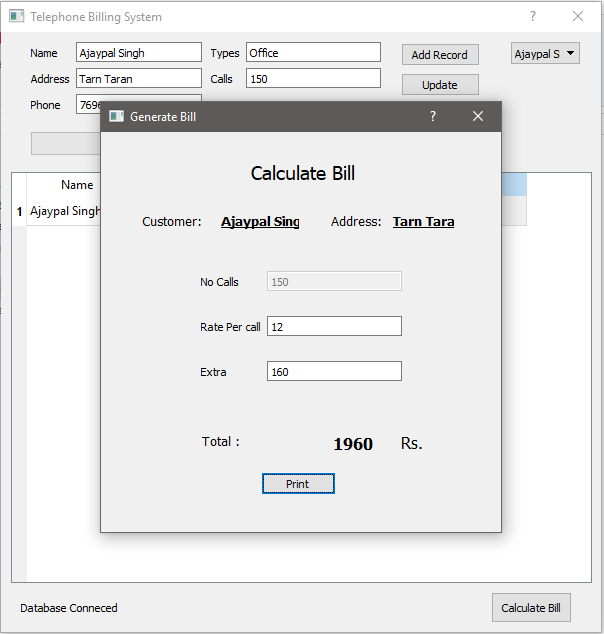

# Telephone-Billing-System-C-Plus-Plus-QT

Telephone Billing System is developed In C++ QT. It has Little Functionality Which shows Complete CURD Operation. SQLite Database Integration is Included in this project. It Has functionality like Login, Add Customer, deletes a customer, Updates customer, Generates bill With the help of Graphical user interface.

## Screenshot

